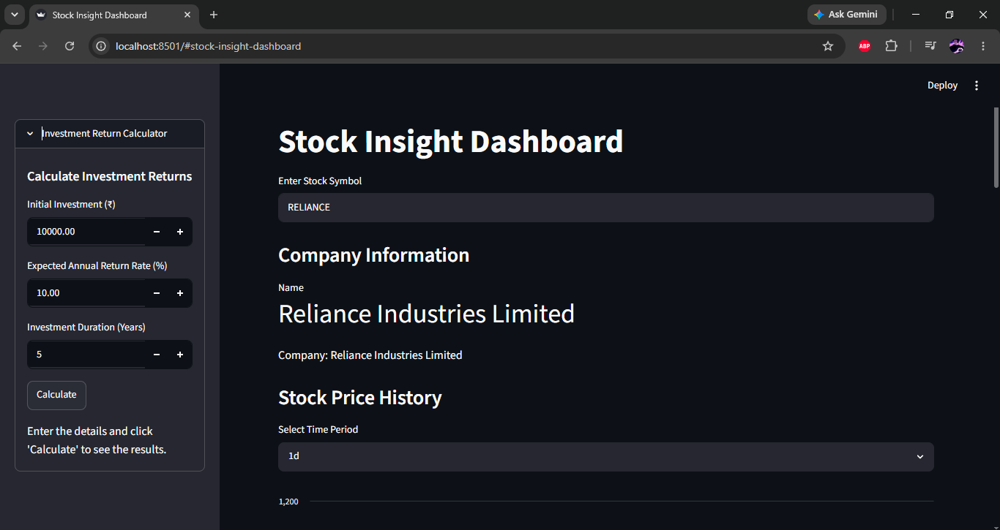
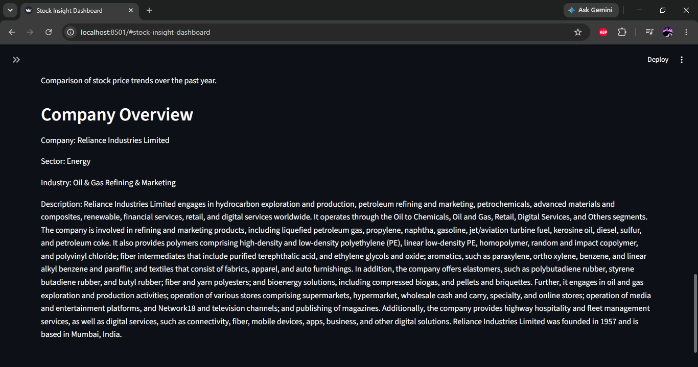

# Stock-Insight-dashboard
A dashboard that allows users to analyze data, visualize trends, and gain simple market insights.

## Tech:
- Python
- Pandas
- Streamlit
- Git
- Plotly
- yfinance

## Features:
- Stock Search
- Multi stock Comparison
- Historical Charts
- Investment Calculator
- Company Information
- Error Handling

## Screenshots

## Future Improvements
- Seach bar suggestion
- Better UI
- BETTER UX 
- User friendly improvement
- publish it in web as Verson 1