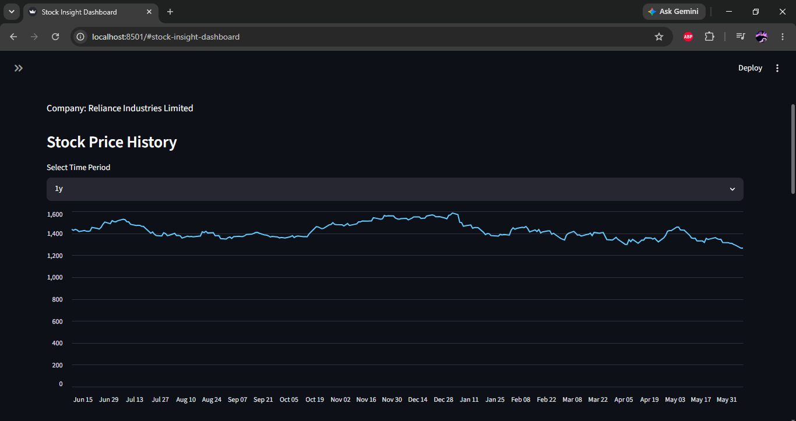
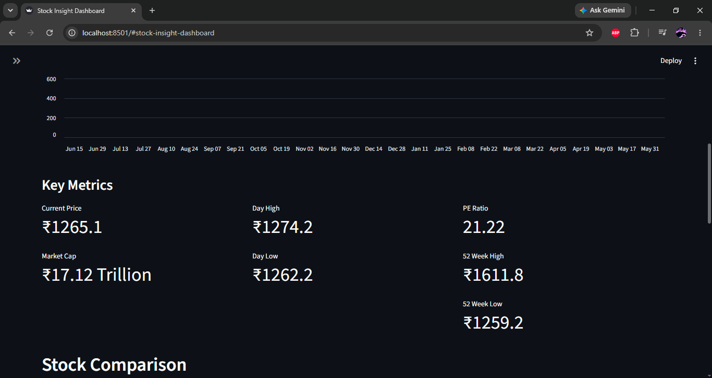
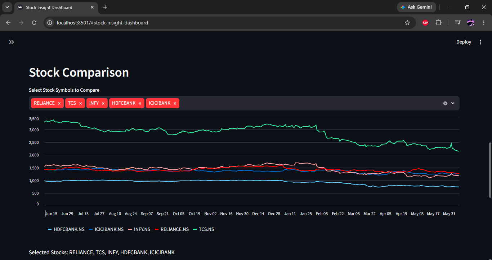

### Stock Insight Dashboard

A Streamlit-based dashboard that allows users to search Indian stocks, analyze market data, visualize trends, and gain simple investment insights.

## Tech Stack
- Python
- Pandas
- Streamlit
- Plotly
- yfinance
- Git
- Features
- Stock Search
- Multi-Stock Comparison
- Historical Stock Charts
- Investment Return Calculator
- Company Information Dashboard
- Error Handling

## Features
- Stock Search
- Historical Stock Charts
- Multi Stock Comparison 
- Investment Return Calculator  
- Company Information  
- Error Handling

## Screenshots






## Installation
- Clone the repository

- git clone https://github.com/your-username/Stock-Insight-dashboard.git

- cd Stock-Insight-dashboard

- Install dependencies

- pip install -r requirements.txt

- Run the application

- streamlit run app.py

## 📂 Project Structure
```text
Stock-Insight-dashboard/
│
├── app.py
├── companies.csv
├── requirements.txt
├── README.md
└── Screenshots/
    ├── Mainpage.png
    ├── StockHistory.png
    ├── matrix_keys.png
    ├── Multi-compare-stock.png
    └── overview-comp.png
```

Version 1 complete

## Project Status

✅ Version 1 Completed

This project was built to practice data visualization, financial data analysis, and dashboard development using Streamlit.

Future improvements may be added in later versions.
